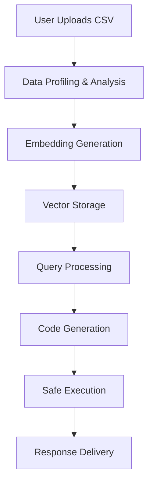

# 🤖 AI Data Analyst - Chat with Your CSV

[](https://streamlit.io/)
[](https://openai.com/)
[](https://langchain.com/)
[](https://python.org)

A powerful RAG (Retrieval-Augmented Generation) application that allows you to converse with your CSV files using natural language. Upload your data, ask questions, and get instant insights powered by AI.

 *← Add a screenshot/gif here!*

## 🚀 Features

- **Natural Language Interface**: Ask questions like "What's the average sales price?" instead of writing code
- **Multimodal Analysis**: Handles text, numbers, and generates visualizations
- **Cost-Efficient**: Uses smart chunking and embeddings to minimize API costs (~$0.00035 per query)
- **Secure Execution**: Sandboxed code execution environment
- **Beautiful UI**: Built with Streamlit for professional-grade user experience

## 🛠️ Tech Stack

- **Frontend**: Streamlit
- **AI Framework**: LangChain
- **LLM**: OpenAI GPT-3.5-turbo & text-embedding-ada-002
- **Vector Database**: ChromaDB
- **Data Processing**: Pandas, NumPy
- **Visualization**: Matplotlib

## 📦 Installation

1. **Clone the repository**
   ```bash
   git clone https://github.com/your-username/ai-data-analyst.git
   cd ai-data-analyst
   ```

2. **Set up virtual environment**
   ```bash
   python -m venv venv
   source venv/bin/activate  # On Windows: venv\Scripts\activate
   ```

3. **Install dependencies**
   ```bash
   pip install -r requirements.txt
   ```

4. **Configure environment variables**
   ```bash
   echo "OPENAI_API_KEY=your_openai_api_key_here" > .env
   ```

5. **Run the application**
   ```bash
   streamlit run app.py
   ```

## 💡 Usage

1. **Upload** a CSV file using the sidebar
2. **Click** "Process File" to analyze your data
3. **Ask questions** in natural language:
   - "What are the column names?"
   - "What is the average price?"
   - "Show me the correlation between sales and profit"
   - "Plot a histogram of customer ages"

## 🏗️ Architecture



## 📸 Demo

*Add 2-3 screenshots here:*
1. Upload interface
2. Sample questions and answers  
3. Visualization example

## 🎯 Key Learning Outcomes

- **RAG Implementation**: Built a complete Retrieval-Augmented Generation pipeline
- **Vector Databases**: Hands-on experience with ChromaDB and embeddings
- **AI Safety**: Implemented secure code execution sandboxing
- **Cost Optimization**: Engineered for minimal API usage while maintaining accuracy
- **Full-Stack Development**: Integrated backend AI with frontend UI

## 🤝 Contributing

Feel free to fork this project and submit PRs for:
- Support for more file types (Excel, JSON)
- Additional visualization types
- Improved error handling
- Enhanced UI features

## 📄 License

This project is licensed under the MIT License - see the [LICENSE](LICENSE) file for details.

## 🙏 Acknowledgments

- Built with [LangChain](https://langchain.com/) for the AI orchestration
- Powered by [OpenAI](https://openai.com/) for language model capabilities
- UI built with [Streamlit](https://streamlit.io/)

---

**⭐ Star this repo if you found it helpful!**